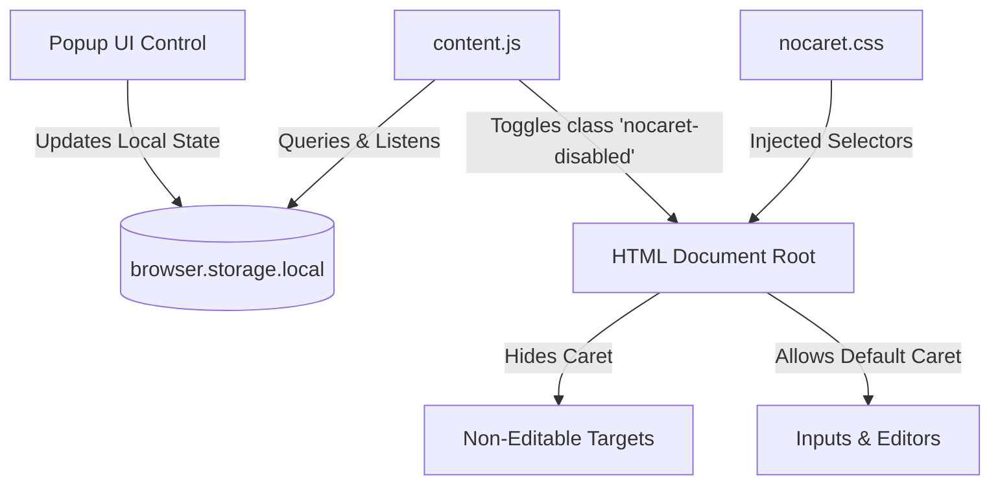
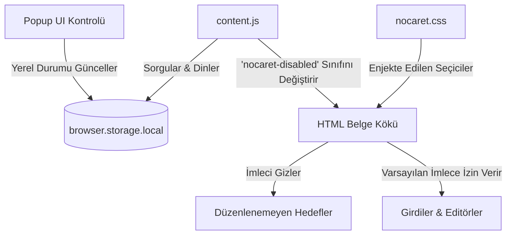

# NoCaret

  

  <strong>A Firefox WebExtension designed to selectively manage text caret visibility on non-editable elements.</strong>

  
  
  
  

---

# English Documentation

## 📖 Introduction

In Firefox (Gecko layout engine), clicking on non-editable elements such as media players, images, or layout wrappers can trigger a blinking text insertion cursor (caret). This behavior, associated with browser focus states and text selection configurations, can interfere with visual interfaces.

**NoCaret** is a WebExtension that prevents this behavior. By injecting optimized CSS rules, it hides text carets on non-editable zones while preserving standard text insertion indicators in input fields and rich-text editing components.

---

## 🦊 Firefox Store Status & Future Plans

> [!NOTE]
> **Firefox Review Status:** NoCaret is currently self-hosted and has not yet been submitted or officially approved on the Firefox Add-ons (AMO) store.
> 
> **Future Roadmap:** We plan to submit the extension to the official Firefox Add-on Store for verification and public listing in future releases. Currently, it can be loaded manually as a temporary developer add-on.

---

## ⚡ Technical Specifications

| Parameter | Performance & Compatibility |
| :--- | :--- |
| **Execution Latency** | `0ms` (Natively evaluated on browser style-matching cycles) |
| **Memory Footprint** | `< 1.2 MB` (Extremely lightweight execution state) |
| **CPU Utilization** | `0%` (Zero active event loops or polling processes) |
| **Firefox Compatibility** | `v140+` (Desktop) / `v142+` (Android) — Fully configured under Manifest V3 specifications |

---

## 📐 Architecture & Data Flow

The extension operates via the WebExtension Storage API to toggle CSS rules across active document contexts.

---

## 📊 Protection Scope Matrix

| Component | Caret State | Targeting Method | Details |
| :--- | :---: | :--- | :--- |
| **Media Players** | 🚫 Hidden | `video`, `canvas`, `audio` | Prevents caret rendering on video controls. |
| **Images & Assets** | 🚫 Hidden | `img`, `svg`, `figure` | Disables insertion caret on static visual media. |
| **Blank Zones** | 🚫 Hidden | Non-editable wrapper nodes | Suppresses carets in structural layouts on click. |
| **Inputs** | ✓ Active | `input`, `textarea` | Retains native caret features and site-specific styling. |
| **Rich Editors** | ✓ Active | `[contenteditable]`, `:read-write` | Preserves editing capabilities (e.g. Notion, Google Docs). |

---

## ⚙️ Component Architecture Walkthrough

### 🛠️ Configuration Layer (`manifest.json`)
The core configuration file defining WebExtension metadata, browser action definitions, background rules, and style sheet mappings.

### 🎨 Style Engine (`nocaret.css`)
The native CSS rule declarations that perform high-frequency target checks on rendering threads.

### 🔄 State Handler (`content.js` & `popup.js`)
Reactive bridge monitoring storage changes and evaluating document active states in real-time.

---

> [!NOTE]
> **Performance Impact:** CSS Injection rules perform style matches directly on the browser rendering thread, ensuring negligible execution latency and CPU overhead.

> [!IMPORTANT]
> **Custom Caret Styles:** The caret restoration selector uses low specificity without the `!important` flag, ensuring custom site caret colors (e.g., `input { caret-color: red }`) are preserved.

---

## 💾 Local Installation (Firefox MV3)
To load the WebExtension locally for development purposes:
1. Open Firefox and navigate to `about:debugging#/runtime/this-firefox`.
2. Click the **"Load Temporary Add-on..."** button.
3. Select the **`manifest.json`** file from this project directory.
4. Access the control panel via the toolbar extension button (🧩) to manage active states.

---

## 🤝 Contribution Guidelines
We highly value community contributions! As long as your changes are intended for **non-commercial** purposes, feel free to submit Pull Requests (PRs), open issues, or suggest improvements to help make NoCaret better.

*Note: By submitting a Pull Request, you agree to grant the author (Atilla Yalın Öksüz) an irrevocable, perpetual, worldwide, and royalty-free license to use, modify, and distribute your contribution under the terms of this project's license.*

---

## ⚖️ License & Copyright

**Copyright © 2026 Atilla Yalın Öksüz. All rights reserved.**

This project and all associated source code and assets are the exclusive property of Atilla Yalın Öksüz. 
Except as expressly permitted by the GitHub Terms of Service (such as viewing and forking within the GitHub platform), no one is allowed to use, copy, modify, merge, publish, distribute, sublicense, and/or sell copies of the software without prior written consent from the author.

**Governing Law & Jurisdiction:** Any legal disputes arising from this software shall be governed by the laws of the Republic of Turkey, and the courts of Antalya shall have exclusive jurisdiction.

[📖 View Full License Details](https://github.com/atilla-yalin-oksuz/NoCaret/blob/main/LICENSE)
### Legal Representative Approval
I, as the parent / legal representative of the developer Atilla Yalın Öksüz, hereby grant full consent and approval to the publishing terms and rights retention of this software under the specific terms specified herein.
- **Legal Representative:** Verified and Approved by Parent/Guardian
---

## 👥 Creator Details
- **Developer:** Atilla Yalın Öksüz
- **Developer GitHub:** [https://github.com/atilla-yalin-oksuz](https://github.com/atilla-yalin-oksuz)
- **Repository:** [NoCaret GitHub Repository](https://github.com/atilla-yalin-oksuz/NoCaret)
- **Developer Age & Background:** Born in **2013** (Supported under parental stewardship). A student developer passionate about web engineering and building open-source browser extensions under parental guidance.

_NoCaret is created out of curiosity and a passion for web technologies. Under the guidance of family approval, all development processes follow safety and open learning principles._

---
---

# Türkçe Dokümantasyon

## 📖 Giriş

Firefox'ta (Gecko tasarım motoru), medya oynatıcıları, resimler veya yapısal sarmalayıcılar gibi yazılabilir olmayan elemanlara tıklandığında yanıp sönen bir metin imleci (caret) belirebilir. Tarayıcı odak durumları ve metin seçimi yapılandırmalarıyla ilgili olan bu davranış, görsel arayüzleri bozabilir.

**NoCaret**, bu durumu engelleyen bir WebExtension'dır. Optimize edilmiş CSS kuralları enjekte ederek, düzenlenemeyen alanlarda metin imleçlerini gizlerken, girdi alanlarında ve zengin metin düzenleme bileşenlerindeki standart metin imleçlerini korur.

---

## 🦊 Firefox Mağaza Durumu ve Gelecek Planları

> [!NOTE]
> **Firefox İnceleme Durumu:** NoCaret şu anda bağımsız olarak barındırılmaktadır ve henüz Firefox Eklentiler (AMO) mağazasına gönderilmemiş veya resmi onay almamıştır.
> 
> **Gelecek Yol Haritası:** Eklentiyi doğrulama ve genel listeleme için gelecekteki sürümlerde resmi Firefox Eklenti Mağazası'na göndermeyi planlıyoruz. Şu anda, geçici geliştirici eklentisi olarak manuel yüklenebilir.

---

## ⚡ Teknik Özellikler

| Parametre | Performans & Uyumluluk |
| :--- | :--- |
| **Çalışma Gecikmesi** | `0ms` (Tarayıcı stil eşleme döngülerinde doğal olarak çalışır) |
| **Bellek Kullanımı** | `< 1.2 MB` (Son derece hafif çalışma durumu) |
| **İşlemci Kullanımı** | `0%` (Aktif olay döngüsü veya sorgulama içermez) |
| **Firefox Uyumluluğu** | `v140+` (Masaüstü) / `v142+` (Android) — Manifest V3 spesifikasyonlarına göre yapılandırılmıştır |

---

## 📐 Mimari ve Veri Akışı

Eklenti, CSS kurallarını aktif sayfa bağlamlarında açıp kapatmak için WebExtension Storage API aracılığıyla çalışır.

---

## 📊 Koruma Kapsamı Matrisi

| Bileşen | İmleç Durumu | Hedefleme Yöntemi | Detaylar |
| :--- | :---: | :--- | :--- |
| **Medya Oynatıcılar** | 🚫 Gizli | `video`, `canvas`, `audio` | Video kontrollerinde imleç oluşumunu engeller. |
| **Resimler & Varlıklar** | 🚫 Gizli | `img`, `svg`, `figure` | Statik görsel medyadaki imleci devre dışı bırakır. |
| **Boş Alanlar** | 🚫 Gizli | Düzenlenemeyen sarmalayıcı düğümler | Tıklamada yapısal düzenlerdeki imleçleri bastırır. |
| **Girdiler** | ✓ Aktif | `input`, `textarea` | Doğal imleç özelliklerini ve siteye özel stilleri korur. |
| **Zengin Editörler** | ✓ Aktif | `[contenteditable]`, `:read-write` | Düzenleme yeteneklerini korur (Örn. Notion, Google Docs). |

---

## ⚙️ Bileşen Mimarisi İncelemesi

### 🛠️ Yapılandırma Katmanı (`manifest.json`)
WebExtension meta verilerini, tarayıcı eylemlerini ve stil sayfası eşlemelerini tanımlayan temel yapılandırma dosyası.

### 🎨 Stil Motoru (`nocaret.css`)
Tarayıcı işleme motorunda yüksek frekanslı hedef denetimleri gerçekleştiren yerel CSS kural bildirimleri.

### 🔄 Durum Yöneticisi (`content.js` & `popup.js`)
Depolama değişikliklerini izleyen ve belge aktif durumlarını gerçek zamanlı olarak değerlendiren reaktif köprü.

---

> [!NOTE]
> **Performans Etkisi:** CSS Enjeksiyon kuralları stil eşleşmelerini doğrudan tarayıcı işleme motorunda gerçekleştirerek ihmal edilebilir gecikme ve sıfır CPU yükü sağlar.

> [!IMPORTANT]
> **Özel İmleç Stilleri:** İmleç geri yükleme seçicisi, `!important` işareti olmadan düşük özgüllük kullanır, böylece sitelerin özel imleç renklerinin (ör. `input { caret-color: red }`) bozulmamasını sağlar.

---

## 💾 Yerel Kurulum (Firefox MV3)
WebExtension'ı geliştirme amacıyla yerel olarak yüklemek için:
1. Firefox'u açın ve adres çubuğunda `about:debugging#/runtime/this-firefox` sayfasına gidin.
2. **"Geçici Eklenti Yükle..."** butonuna tıklayın.
3. Proje dizininizden **`manifest.json`** dosyasını seçin.
4. Aktif durumları yönetmek için araç çubuğundaki eklenti düğmesi (🧩) aracılığıyla kontrol paneline erişin.

---

## 🤝 Katkıda Bulunma Rehberi
Topluluk katkılarına büyük değer veriyoruz! Değişiklikleriniz **ticari olmayan** amaçlar taşıdığı sürece, NoCaret eklentisini geliştirmek için Pull Request (PR) gönderebilir, hata bildirimleri oluşturabilir veya geliştirme önerilerinde bulunabilirsiniz.

*Not: Bir Pull Request (PR) göndererek, katkınızın bu projenin lisans şartları altında yazar (Atilla Yalın Öksüz) tarafından kullanılmasına, değiştirilmesine ve dağıtılmasına geri alınamaz, süresiz, dünya çapında ve telifsiz bir lisans vermiş olursunuz.*

---

## ⚖️ Lisans & Telif Hakkı

**Telif Hakkı © 2026 Atilla Yalın Öksüz. Tüm hakları saklıdır.**

Bu proje ve ilişkili tüm kaynak kodları ile materyallerin tek ve mutlak sahibi Atilla Yalın Öksüz'dür.
GitHub Hizmet Şartları'nın açıkça izin verdiği durumlar (GitHub platformu dahilinde görüntüleme ve fork etme gibi) hariç olmak üzere; yazarın önceden verilmiş yazılı izni olmaksızın bu yazılımın kullanılması, kopyalanması, değiştirilmesi, birleştirilmesi, yayımlanması, dağıtılması, alt lisanslanması ve/veya satılması kesinlikle yasaktır.

**Uygulanacak Hukuk ve Yetkili Mahkeme:** Bu yazılımdan doğabilecek her türlü hukuki uyuşmazlıkta Türkiye Cumhuriyeti kanunları uygulanacak olup, Antalya Mahkemeleri ve İcra Daireleri kesin yetkilidir.

[📖 Detaylı Lisans Metnini Görüntüle](https://github.com/atilla-yalin-oksuz/NoCaret/blob/main/LICENSE)
### Yasal Temsilci Onayı
Geliştirici Atilla Yalın Öksüz'ün velisi / yasal temsilcisi olarak, bu yazılımın haklarının saklı tutulmasına, GitHub üzerinde yayınlanmasına ve burada belirtilen tüm özel şartlara tam yetki ve onay veriyorum.
- **Yasal Temsilci:** Veli Tarafından Doğrulanmış ve Onaylanmıştır
---

## 👥 Geliştirici Bilgileri
- **Geliştirici:** Atilla Yalın Öksüz
- **Geliştirici GitHub:** [https://github.com/atilla-yalin-oksuz](https://github.com/atilla-yalin-oksuz)
- **Depo (Repository):** [NoCaret GitHub Deposu](https://github.com/atilla-yalin-oksuz/NoCaret)
- **Geliştirici Yaşı & Geçmişi:** **2013** doğumlu (Aile/veli gözetimi ve desteğinde). Web teknolojilerine ilgi duyan ve aile denetiminde açık kaynaklı tarayıcı eklentileri geliştiren öğrenci yazılımcı.

_NoCaret, web teknolojilerine duyulan merak ve tutkuyla oluşturulmuştur. Aile onayı ve rehberliğinde yürütülen tüm geliştirme süreçleri, güvenlik ve açık öğrenme ilkelerini takip eder._
